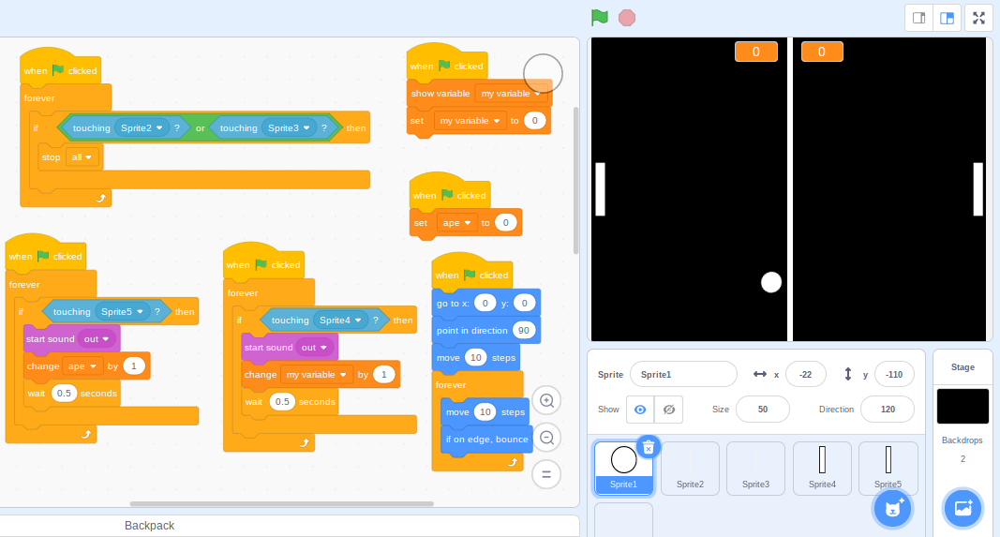
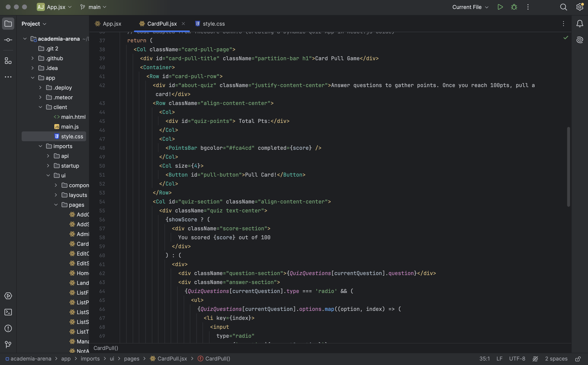

When I was younger, my favorite Christmas gift was a Star Wars Lego set. It wasn’t grand – it was a small pod-racer set from The Phantom Menace. It wasn’t even mine, really – it was meant for my brother, but growing up, we often shared our toys. The set came with two pod-racers, so my brother started building one, and I built the other. I sorted out the pieces and went page by page with the instructions booklet. My brother got tired – he was also 7 – and preferred playing to the assembling process, so I ended up having to build both.

I loved it. The process went by too fast for me, but there was something rewarding about seeing the shape in the booklet materialize in my hands, by my hands. I didn’t get many Lego sets as the years went by, but before going to sleep, I would watch Lego set speed builds. I played Lego Star Wars (the only game that I played), and occasionally I would take apart the set just to put it back together again.

There was something so satisfying about seeing how each piece could be utilized in a set, in seeing how the smaller sections that would be put together independently end up fitting right in with each other as they’re maneuvered together.

There was creativity, but there was also structure.

## Brick by Byte: How LEGO building is like Code Building 

I saw this structural pattern present when I learned how to code. I learned using Scratch in class, and the block-like manner that the code existed in reminded me of how it felt playing with Legos. Piece by piece, you can attach blocks of code to another and create a fully functioning program.

When I code, I use the same approach as building with Legos, called the Builder Design Pattern. This pattern separates making an object from how it looks. It has a basic outline (Builder) for making parts of a complex object and specific ways to make each part. I add or set up different parts of the object by using methods on the builder, step by step. This way of building makes it easier to put things together in different ways. The Director class manages the steps, but it's optional. It helps organize the order in which the builder's methods are used. In the end, we get the finished object by using a method on the builder.

When you build with Legos, you start by putting individual pieces together to make something bigger. By arranging the pieces differently, you can make all sorts of different things from the same set of bricks. This is a lot like the Builder Pattern in coding. It's a way of making complex objects step by step, adding pieces as you go. You can change how you put things together to make different variations of objects.

In both Legos and the Builder Pattern, you can reuse pieces or components. With Legos, you can use the same pieces to build different things. Similarly, in coding, you can reuse parts of the building process to make similar objects. Both methods help deal with complexity by breaking things down into smaller, manageable parts.

Designing is often linked with creativity, as it rightly should be. Both Lego creations and code often amaze people with their ingenuity. However, the foundation of these creations lies in their underlying structure, supporting the beauty of their design.
