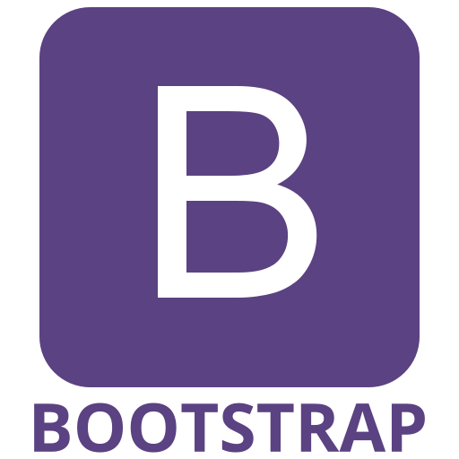
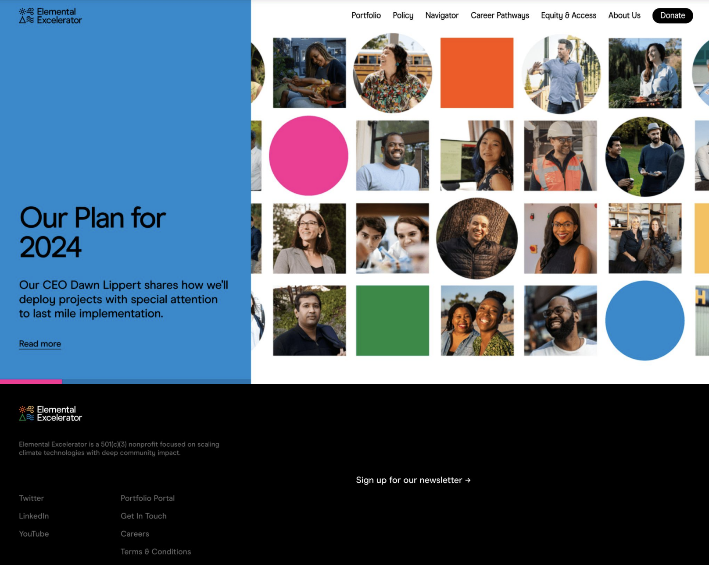
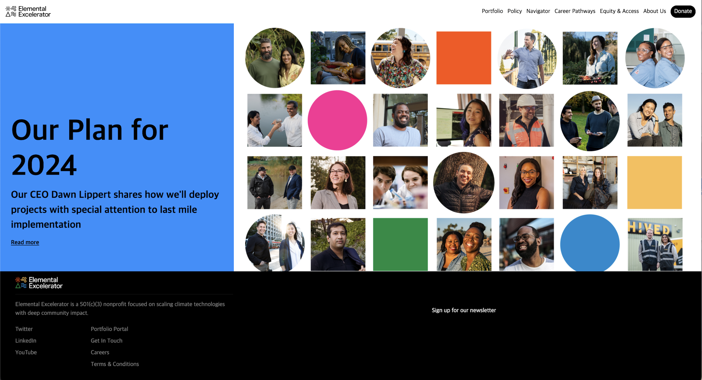

When I saw an ugly website, my first thought would be *“how could someone actually put this out there?"* With various website builders like Wix making it so easy to create visually appealing and functional sites, I figured that designing a website shouldn’t be too difficult.  But when I attempted to recreate a website with the html and css that I’ve learned, I felt humbled – it was ugly. The type of ugly you want to never put out on the web with your name attached to it. That got me thinking: *what does it take to design something that actually looks good?*

 

# The Basics of UI Frameworks

UI frameworks like Bootstrap and Semantic UI offer a pre-designed set of components, styles, and utilities that streamline the process of building user interfaces.

At first glance, this might not seem like a big deal. After all, can't we just craft our own styles and layouts from scratch using raw HTML and CSS? Sure, but that's like reinventing the wheel every time we need to build a car.

The main benefit of UI frameworks is it makes designing convenient. Instead of coding out every button, form field, and navigation bar from scratch, you can simply drop in pre-made components that are already styled and responsive. This can help make website development faster and more consistent across projects. Plus, most UI frameworks, especially Bootstrap 5, come with extensive documentation, making it easier to troubleshoot issues and learn best practices.

From a software engineering perspective, UI frameworks reusable code, and it encourages developers to break their interfaces down into smaller, more manageable components. Being able to take code and re-implement them in different situations is a skill that grows the more familiar you get with using Bootstrap.

In many ways, Bootstrap makes things convenient.

 

# My Experience with Bootstrap 5

Of course, UI frameworks have their limitations and drawbacks. 

I have to admit, Bootstrap isn't my favorite tool to work with. Personally, I struggle to find it readable. The abundance of classes and nested structures can make the HTML markup hard to follow, leading to frustration in my workflow. And while they offer a great starting point, Bootstraps rigid conventions don't always align with the specific design I have in mind. This means they can lead to cookie-cutter and awkward designs. Plus, there's a learning curve involved in mastering any new framework, which can be frustrating for developers already juggling multiple languages and technologies.

While I do appreciate the convenience Bootstrap offers, there are definitely times when I wish for a more intuitive and customizable framework that suits my coding style and project requirements better.

Here is an example of a site I attempted to create: 

  
  

Definitely some notable difference. The originial website probably used tools beyond Bootstrap, and while Bootstrap helped me design a site that came pretty close, it definitely wasn't pixel perfect.

# My Insights on Pretty Sights

Creating a well designed website is no easy task. It demands a blend of creativity, technical skills, and an eye for design. While UI frameworks like Bootstrap 5 offer a shortcut to achieving visually appealing results, learning it came with a steep learning curve. Despite the initial challenges, using Bootstrap built my understanding of html and css and I've found inspiration in the potential to craft more aesthetically pleasing websites. 

While Bootstrap has served as a valuable starting point, my frustrations with it motivates me to broaden my skills beyond it. Bootstrap has allowed me to learn a skillset invaluable to creating webpages, and I want to expand on them. I'm setting my sights on making prettier websites, and mastering UI frameworks is a step that takes me closer to that goal. 

*ChatGPT used for description on UI frameworks and to spell checks*

