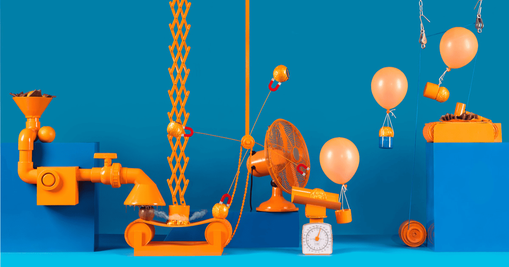
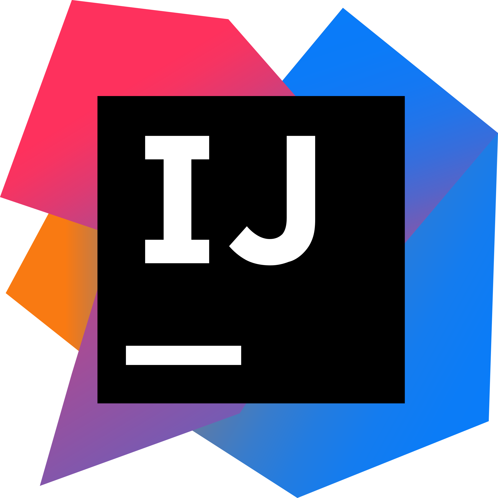
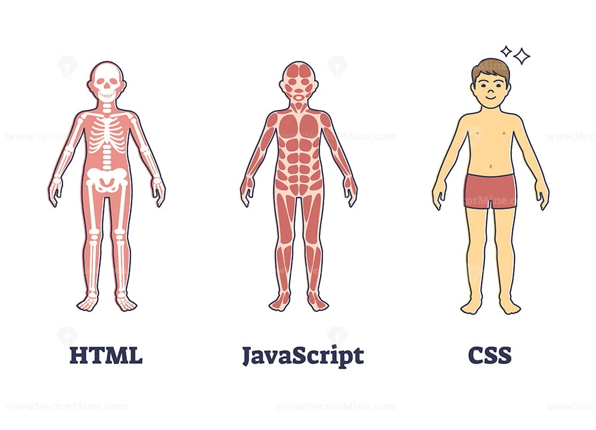

My favorite ice breaker question that I've ever been asked was, *"What random skill would you want to be the best at?"* I said building Rube Goldberg Machines. It's partly my favorite because I was proud to come up with such a niche answer and everyone said *Oh!*, but also because I find that Rube Goldberg machines are inventions that garners everyones fascination.

A Rube Goldberg machine involve a series of reactions that trigger one random event after another until the final event is set off. In a way, we've all grasped the concept of Rube Goldberg machines; they're ingenious contraptions that take an object, typically a ball, on a convoluted path just to end up in a cup. 

  

 

I've always felt like my journey in software development was like a Rube Goldberg machine — sequential yet nonlinear, sometimes feeling disjointed, both complex and simple, and yet fun to watch. It's a process where various components work together in unexpected ways, much like the reactions in a Rube Goldberg machine. This semester has been a particularly enjoyable adventure, with each step feeling like a unique piece in a larger, intricate puzzle.

 

## Development Environments

In my previous classes, I had exposure to various Integrated Development Environments (IDEs) such as Eclipse, some VSCode, and UNIX. Delving into IntelliJ felt both familiar and new at the same time. IntelliJ IDEA provides a clean and intuitive interface for coding, which made the transition into using it quite smooth. Additionally, when combined with GitHub, IntelliJ offers an integrated environment that streamlines the coding process even further. 

Proficiency in navigating different Integrated Development Environments (IDEs) is crucial for software development. Due to the collaborative nature of projects, being proficient in multiple IDEs enables developers to easily collaborate with teammates who may have different tool preferences, fostering smoother communication and teamwork. Additionally, staying adaptable and open to learning new IDEs ensures that developers can keep up with evolving technology and take advantage of the latest advancements in software development tools.

 

## User Interface Frameworks

In web design, user interface (UI) refers to the interactivity, look, and feel of a product screen or web page. 
Throughout this class, we explored various aspects of web design, including basic HTML and CSS, Bootstrap 5 for creating responsive UIs, React for building component-based interfaces in JavaScript, and the Meteor framework. This has easily been my favorite aspect of my computer science pathway so far. Working with code that directly impacts visual elements is incredibly rewarding, as it allows me to create something aesthetically pleasing and functional.

It directly correlates to user accessibility – influencing their overall experience and satisfaction. A well-designed UI enhances usability, making the software intuitive and easy to navigate, which in turn increases user engagement and adoption.

 

## Ethics in Software Engineering

Throughout the semester, we've had ongoing discussions about the responsible use of AI. Personally, I've gained valuable insight into how to use AI as a tool effectively. One of the most engaging moments came on the last day of instruction, when we debated whether a company should hire a new, AI-proficient computer scientist over a more experienced one with a broader skill set. It was fascinating to see everyone's perspectives merge, with valid points on both sides. Ethics is a critical aspect of our pathway because as we create technology that becomes increasingly pervasive, it's essential to ensure it uplifts people and doesn't cause harm.

 

## End of a Segment, Onto the Next

There have been a couple of modules that stuck out to me this semester, which individually were simple, but altogether accumulated into a semester packed with learning. Learning how to navigate IntelliJ, building my web design skills, and the constant awareness of ethics were some of the aspects that made this class my favorite so far. This semester overall has been a fun segment in my Rube Goldberg Adventure in Computer Science.

