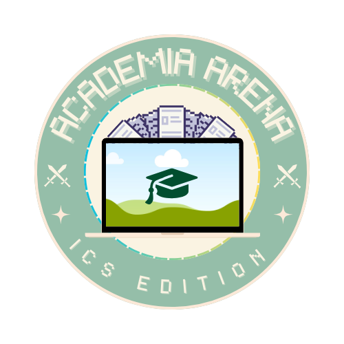
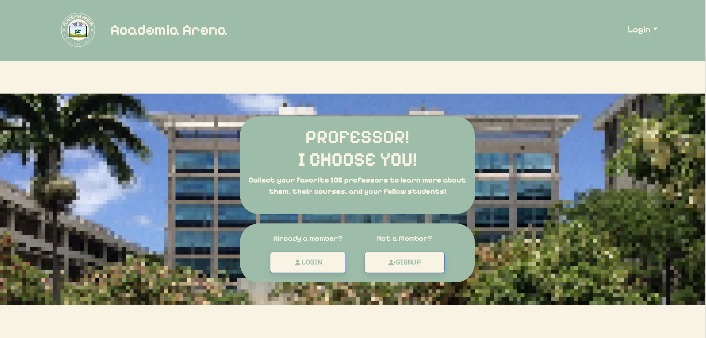
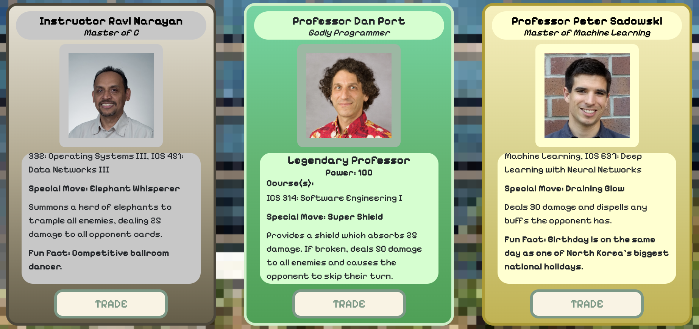
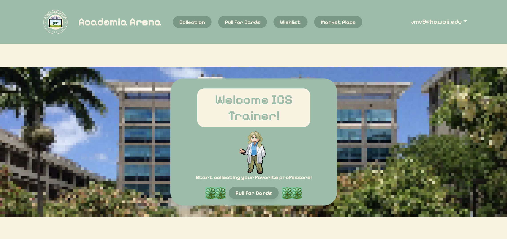
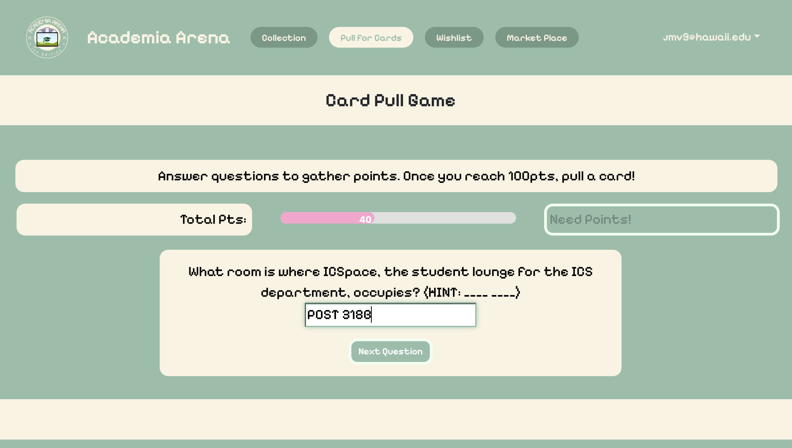

## Overview 

  

For my final project in ICS 314 Software Development, I worked in a group of 6 students developing a trading cards game of the ICS department faculty members. This retro inspired game aims to bridge the gap between faculty members and students by helping students get familiar with faculty faces and learn professors interests and quirks, ultimately seeing them as a human they can talk to.

Aside from the landing page, this game has 5 pages:
<li>Home Page: Users can login or create an account</li>
<li>Collection Page: Users can view the cards they own.</li>
<li>Pull for Cards Page: User can gain cards by answering quiz questions</li>
<li>Wishlist Page: Users can view all the cards in the collection and add to their wishlist</li>
<li>Marketplace Page: Users can trade their cards with other users</li>
 

 Below (from left to right) is an example of the landing page, the cards, and the home page menu.

  
  
  

 

## My Contributions

My main task throughout this project was the [Card Pull Page](https://academia-arena.xyz/pull). This page allows the user to gather points by answering ICS-related questions, and once they reach 100 points they are able to pull for a card.

Features:
<li>React Quiz Component</li>
<li>Visual Points Bar</li>
<li>Pull Button Function</li>
<li>Card Notification Pop-Up</li>
 

For the most part I focused on developing the Card Pull Page. Of the three main components, I struggled the most with the Pull Button Function, which once clicked randomly generates a card from the AllCards collection and adds it into the users collection. It required solid understanding of the Mongo database. For this I turned to one of my teammates for help [Erin Patterson](https://erinlpat.github.io/).

 

## Takeaways for the Future

I am extremely proud of the collective effort of the Academia Arena team. This was my first experience doing a group coding project, and learning how to work in a group setting, organizing commits, and understanding each persons role has been an invaluable lesson. We had a bright vision for where this app could go and for the most part I think we accomplished that. One page we did not get a chance to develop was a battleground stage, but I think the foundations and ideas are there for future development.

In terms of my software developing skills, I feel more confident in my HTML and CSS abilities. Using JavaScript and also MongoDB was a huge learning curve for me, but it is something I see myself growing into in the future. 

Academia Arena is a project that took a lot of care and dedication and I hope that it shows through.

 

## Relevant Links

Our Deployed App -  [Academia Arena: ICS Edition](https://academia-arena.xyz/))

Our GitHub Organization - [Academia Arena Homepage](academia-arena.github.io)

Our Source Code - [Academia Arena Source Code](https://github.com/academia-arena/academia-arena)

