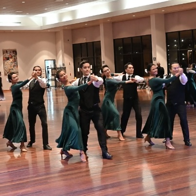
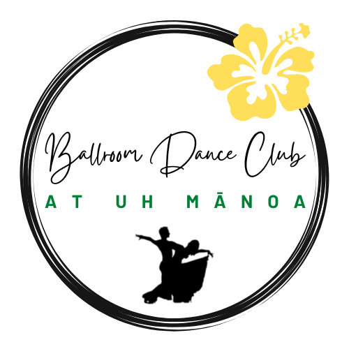
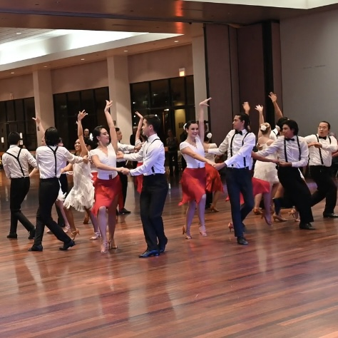

  
  
  

## Ballroom Dance Club at UH Mānoa (BDCUHM)

*The Ballroom Dance Club is a registered independent organization (RIO) that encourages non-dancers and beginners to join and learn how to ballroom dance. I became a member in the spring semester of 2023, and have since continued on to performing in performances and competing in competitions. Currently working towards the next ballroom competition in March - Aloha Ball!*

## Dance, dance, dance!

## Responsibilities Communication Officers

You can learn more at the [Ballroom | ACM @ Manoa](https://acmmanoa.org/pages/clubs/ballroom/).
