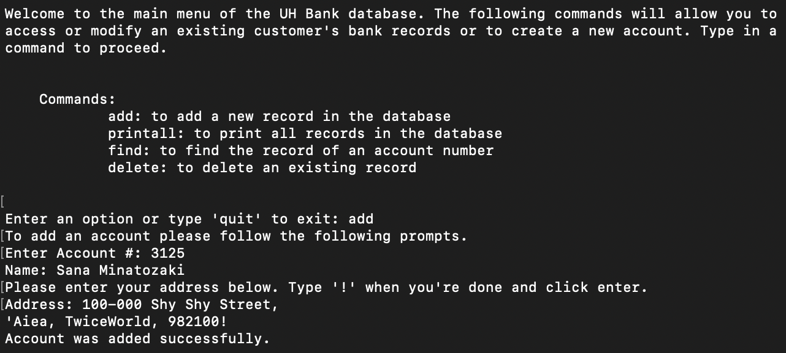

## Overview

This simple database is a program that I created as an assignment in ICS 212, Fall 2023. It's a program that simulates a bank setting and allows the user to add an account, delete an account, find an account, or printall all the accounts that are stored in the database. The user interface displays a menu that lists the commands and takes in user's account number, name, and address, and then sorts the accounts based off of the account number.

### User-Interface

Here is some example of the output to illustrate the code's functionality:

### Takeaways

The project helped me learn how to design a user interface and implement a single linked list data structure. It was developed on UNIX, a multi-user operating system, and coded using C++. In this project I gained experience with C++ and back-end development. 

 

## Relevant Links

Source Code: [C++ Bank Database Source Code](https://github.com/mvchaella/cpp-bank-database)

