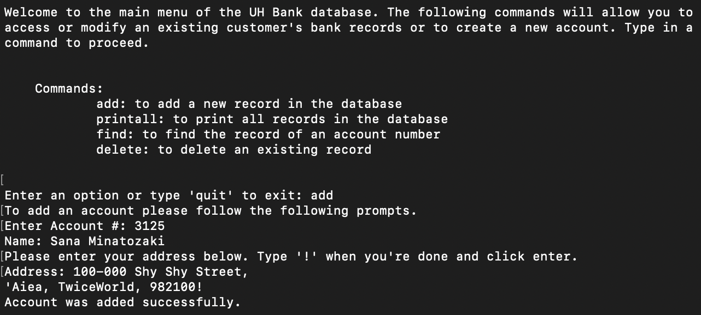

## A Simple Database

This simple database is a program that I created as an assignment in ICS 212, Fall 2023. The project helped me learn how to design a user interface and implement a single linked list data structure. It was developed on UNIX, a multi-user operating system, and coded using C++. 

Throughout the semester, we built skills 

In this project I gained experience with C++ and back-end development. 

Here is some example of the output to illustrate the code's functionality:

Here is a snippet of of some of the code used:

 
Source Code: Not Available Yet
